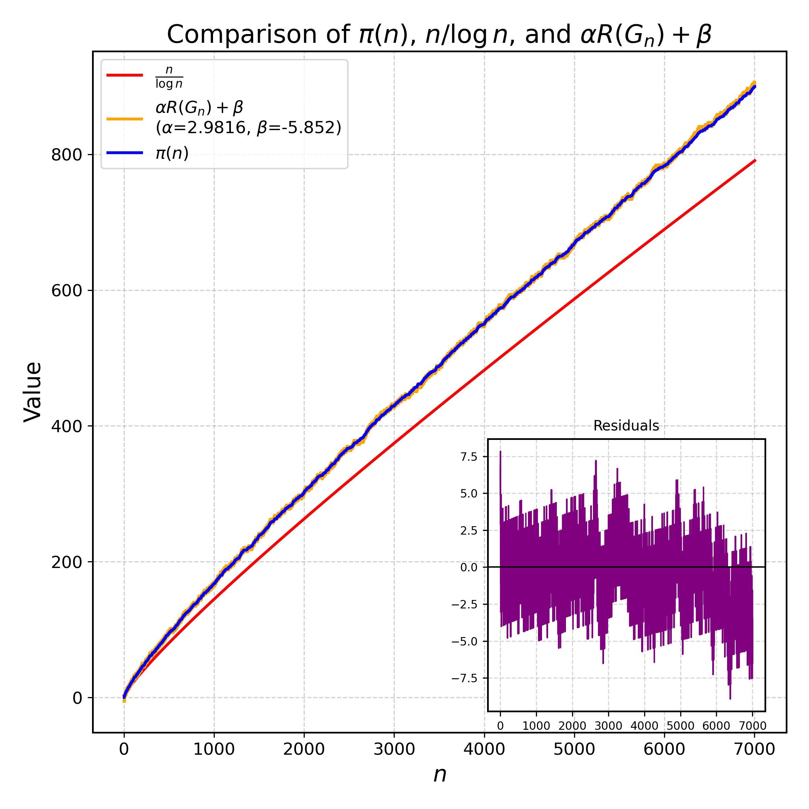

# Conjecture: Linear Residue Law for the Non-Coprime Graph

**Conjecture.**
Let \(G_n\) be the non-coprime graph on vertices \(\{2,3,\dots,n\}\), with edges between \(u,v\) whenever \(\gcd(u,v) > 1\).
If \(R(G_n)\) denotes its Havel–Hakimi residue, then
$$
\pi(n) \sim \alpha\,R(G_n) + \sqrt{n}\log(n),
$$
Moreover, the residuals
$$
\pi(n) - \alpha\,R(G_n)
$$

are integer-valued for long contiguous intervals of \(n\) and increase by exactly \(+1\) at discrete breakpoints — a phenomenon we call the **staircase law**.

**Note.** This conjecture has been tested up to $n=10^5$.

---

## Method of Discovery

This conjecture was uncovered autonomously by the AI-driven conjecturing system **TxGraffiti**.
Initially, TxGraffiti was tasked with finding bounds on \(\alpha(G_n)\) (equivalently \(\pi(n)\)) in terms of \(R(G_n)\) for \(2 \le n \le 100\).
Through its knowledge-removal loop, it rediscovered the classical bound \(\alpha(G_n) \ge R(G_n)\) and then exposed the staircase structure in the difference \(\pi(n) - R(G_n)\).
This prompted a deeper investigation, revealing a highly accurate global linear relation between \(\pi(n)\) and \(R(G_n)\) with a slope and intercept stable across the tested range.

---

## Numerical Evidence

### 1. Scatterplot with Linear Fit and Residual Range

## Implications

Under a slight assumption on the behavior of this conjecture, we note that assumming this conjecture true implies the Riemann Hypothesis.
